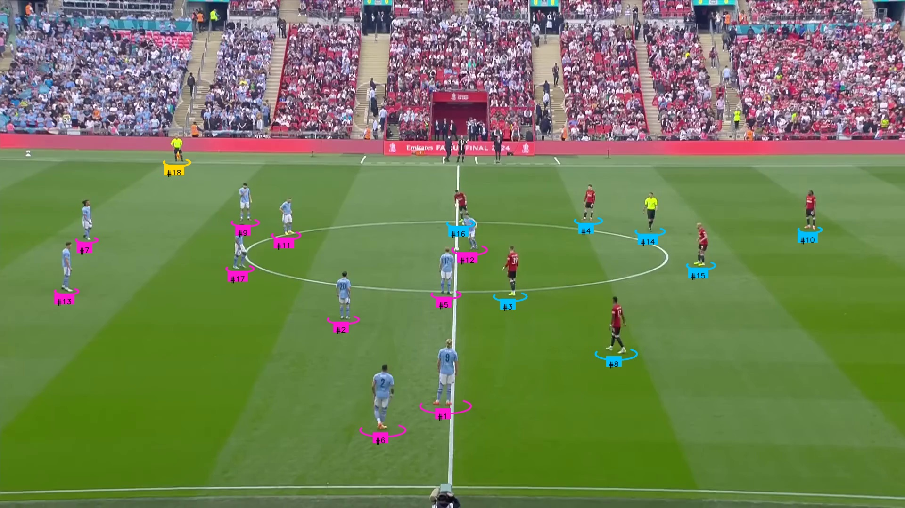
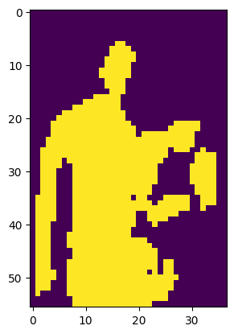
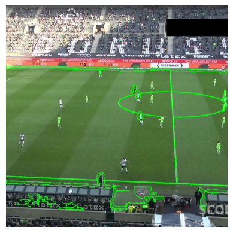
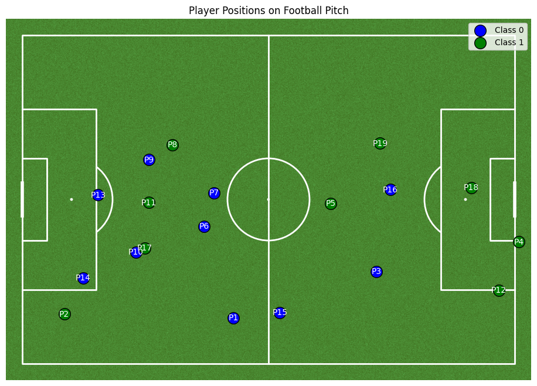

# Football Analysis

## Overview
This project analyses football matches using advanced computer vision techniques, including:
- **YOLO** for object detection (players, ball, referees).
- **ByteTrack** for tracking movements.
- **KMeans** and **SigLip** for team classification.



---

## Key Components

### 1. Input and Output Processing
- **OpenCV** is utilized for:
  - Extracting frames from video inputs.
  - Applying visualizations on the processed frames.
  - Saving the processed frames back into video format.

### 2. Object Detection and Tracking
- **YOLOv11** is used for object detection.[YOLO](https://docs.ultralytics.com/models/yolo11/)
- **ByteTrack** is utilized for tracking players, ball, and referees. [ByteTrack](https://arxiv.org/pdf/2110.06864)
- The initial dataset used was provided by **Bundesliga** on [Kaggle](https://www.kaggle.com/datasets/). It is now available on [Roboflow](https://roboflow.com/).

### 3. Team Classification
#### Workflow:
1. **Player Cropping:**
   - Player crops are extracted from video frames using YOLO detection boxes.
   
   

2. **Background and Torso Clustering:**
   - KMeans is applied to separate the background from player torsos.

|  |  |
|:--:|:--:|
| **Before Clustering** | **After Clustering Background and Torso** |

3. **Team Color Classification:**
   - The colors of players' shirts are clustered to distinguish between two teams.

---

### 3. Ball Interpolation
#### Workflow:
1. **Basic Idea**
   -  The Ball is not detected in many frames, but we know that in most cases, the ball travels in a linear fashion, and in cases where passes are curved, still linear interpolation can be used to fill in missing values.

2. **Interpolation**
   -   We separate out the frames when there is no ball detection in our results dataframe, then insert np.nans into the box column for those and merge the dataframe.
   - Finally, we replace the nans by using linear interpolation

## How to Run
1. Install dependencies:
   ```bash
   pip install -r requirements.txt
   ```
2. Download required models from the `models/` directory.
3. Execute the script:
   ```bash
   python main.py -i {input_video_path} -o {output_path} -r {results_path}
   ```
4. Outputs:
   - Results are saved as **parquet files**.
   - Processed frames and videos are stored in the specified **output path**.

---

## Upcoming Features
1. **Radar View:**
   - Using `mplsoccer` to create a radar view for tactical analysis.

|  |  |
|:--:|:--:|

2. **Enhanced Statistics:**
   - Calculating player metrics such as:
     - Movement speed.
     - Passing accuracy and types of passes.
   - Generating heatmaps and advanced visualizations for deeper insights.

---

